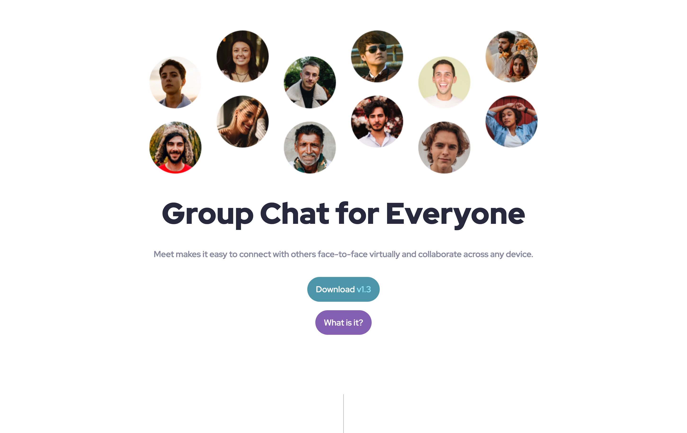

# Frontend Mentor - Product preview card component solution

This is a solution to the [Meet landing page challenge on Frontend Mentor](https://www.frontendmentor.io/challenges/meet-landing-page-rbTDS6OUR/hub). Frontend Mentor challenges help you improve your coding skills by building realistic projects. 

## Table of contents

- [Overview](#overview)
  - [The challenge](#the-challenge)
  - [Screenshot](#screenshot)
  - [Links](#links)
- [My process](#my-process)
  - [Built with](#built-with)
  - [What I learned](#what-i-learned)
- [Author](#author)

## Overview

### The challenge

Users should be able to:

- View the optimal layout depending on their device's screen size
- See hover and focus states for interactive elements

### Screenshot

### Links

- Solution URL: [GitHub](https://github.com/cjdemille/meet-landing-page)
- Live Site URL: [Meet](https://cjdemille.github.io/meet-landing-page/)

## My process

### Built with

- Semantic HTML5 markup
- CSS custom properties
- Flexbox
- Mobile-first workflow

### What I learned

I learned to create vertical lines for spacing and practiced handling the change in the hero image based on screen size. 

## Author

- Website - [C.J. DeMille](https://www.cjdemille.io)
- Frontend Mentor - [@cjdemille](https://www.frontendmentor.io/profile/cjdemille)
